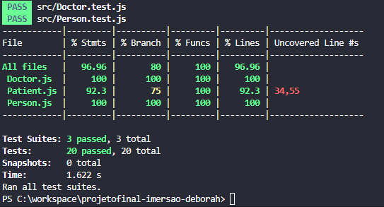

Projeto Projeto Médicos Transfriendly

Este projeto consiste em três classes JavaScript: Pessoa, Médico e Paciente. Essas classes são projetadas para modelar indivíduos em um contexto médico, permitindo criar e gerenciar médicos e pacientes.

Sumário

- Introdução
- Classes
- Uso
- Testes
- Contribuição
- Licença

Introdução

Este projeto fornece uma estrutura simples para gerenciar indivíduos em um contexto médico. Ele inclui três classes:

- Pessoa: Uma classe base que representa atributos e comportamentos comuns de indivíduos.
- Médico: Uma classe que representa médicos, com atributos e ações específicas relacionadas à prática médica.
- Paciente: Uma classe que representa pacientes, com atributos e ações relacionadas ao histórico médico e consultas.

Classes

Pessoa

A classe Pessoa serve como a classe base tanto para médicos quanto para pacientes. Ela inclui os seguintes atributos:

nome: O primeiro nome da pessoa.
sobrenome: O sobrenome da pessoa.
cpf: O CPF (Cadastro de Pessoas Físicas) da pessoa.
endereço: O endereço da pessoa.
celular: O número de celular da pessoa.

A classe Pessoa fornece métodos para:

Aplicar como médico ou paciente.
Fazer login como médico ou paciente.

Médico

A classe Médico estende a classe Pessoa e adiciona os seguintes atributos:

crm: O número de CRM (Conselho Regional de Medicina) do médico.
especialidade: A especialização médica do médico.
agendaDisponível: Um objeto que representa os dias e horários disponíveis do médico.
examesSolicitados: Uma matriz de exames médicos solicitados.
pacientesAtendidos: Uma matriz de pacientes atendidos pelo médico.

A classe Médico fornece métodos para:

Prescrever medicamentos a um paciente.
Atualizar a agenda disponível.
Solicitar exames médicos para pacientes.
Tratar pacientes com base na especialização.
Mostrar os dias e horários disponíveis na agenda.

Paciente

A classe Paciente também estende a classe Pessoa e inclui os seguintes atributos:

históricoMédico: O histórico médico do paciente.
especialidadeMédico: A especialidade médica preferida do paciente.
consultas: Uma matriz de consultas agendadas.
éTransgênero: Uma bandeira booleana que indica se o paciente é transgênero.

A classe Paciente fornece métodos para:

Verificar se o paciente é transgênero.
Escolher a especialidade de um médico.
Realizar exames médicos.
Agendar consultas com base no status de transgênero.
Verificar a disponibilidade da consulta.
Obter o histórico médico do paciente.

Uso

Para usar este projeto, você pode criar instâncias das classes Médico e Paciente, passando os dados apropriados para seus construtores. Você pode então usar os métodos fornecidos por essas classes para simular interações médicas e consultas.

Exemplo de uso:

const joãoSilva = new Doctor('Dr. João', 'Silva', '123456789', 'Rua Principal, 123', '555-1234', '12345', 'Cardiologia');

const mariaSantos = new Patient('Maria', 'Santos', '987654321', 'Rua da Praia, 456', '555-5678', 'Problema cardíaco', false);

joãoSilva.prescreverMedicamento(mariaSantos, 'Aspirina');
mariaSantos.escolherEspecialidadeMédico('Cardiology');

Testes

Para garantir que as classes e métodos funcionem corretamente, você pode criar casos de teste usando um framework de testes como o Jest. Os casos de teste devem abranger vários cenários, incluindo entradas válidas e inválidas, e diferentes interações entre médicos e pacientes.

Contribuição

Contribuições para este projeto são bem-vindas! Se você tiver ideias para melhorias ou correções de bugs, sinta-se à vontade para contribuir abrindo problemas ou solicitações de pull.
